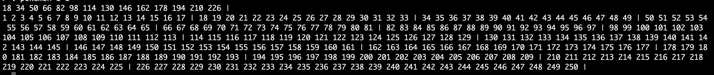

# Buffer Magener

disk-based b+ tree에서 buffer management를 지원하도록 구현한다.

# Policy

- 사용자가 읽고자 하는 페이지가 버퍼에 존재하지 않는다면(캐시 미스), disk로부터 페이지를 읽어 버퍼에 저장한 뒤, 버퍼에 저장된 페이지를 읽는다
- page 수정은 buffer에서만 발생하며, 버퍼에 존재하는 페이지 프레임이 업데이트 될 때 버퍼 블럭에 dirty-page를 표시한다.
- LRU policy에 따라, least recently used buffer가 victim page로 선정되어, LRU page eviction시 disk write가 발생한다.

# 컴파일 실행환경

Make
gcc compiler
macOs monterey 15.0.0(Ubuntu 20.04)

# 목차

1. 구현결과
2. 구현함수

# 1. 구현 결과물

make로 만들어진 main함수를 가지고 실행합니다. 이때 argv[1]에는 할당할 블락의 개수를 입력해야 합니다.

pokemon DB에 (1, 1) = key, value부터 (250, 250까지 넣은 B+ tree의 결과물이 나타납니다.

# 2. 구현함수

## 1) file_read_page

disk로 부터 page를 읽어오기 위한 함수이다.

- find_buf()를 통해서 전체 buffer에서 page를 찾고 존재하지 않는다면, file read를 진행한다.
- file read후, 페이지를 버퍼에서 읽어들이기 위해 find_Buf()를 한번 더 실행한다.
- 이때 find buf에서 page가 존재한다면, LRU policy에 의해 버퍼를 가장 앞으로 위치시킨다.

## 2) buffer_read_to_page

특정 page에대항 read 요청시, 버퍼에 존재하지 않는 경우 file에서 page를 버퍼로 불러오는 함수이다.
이는 cache miss에 대응된다.

### case 1. 사용된 버퍼수 == 1

- 첫번째 버퍼인 경우, 첫번째 버퍼의 prev Buffer를 자신으로 지정하여, Buffermanager의 firstBuffer의 previous buffer를 least recently한 버퍼를 바로 탐색하는 것이 가능하도록 설계했습니다.

### case 2. 사용된 버퍼수 < Buffer Order

- file에서 읽어 온 page는 버퍼에 저장되고, 해당 버퍼는 LRU policy에 따라 buffermanager의 firstBuffer가 된다.
- file에서 읽어 온 buffer의 next buffer가 되고, 아직까지 교체되지 않은 firstBuffer의 Previous buffer는 새로운 buffer가 된다.
- 그 뒤, firstBuffer는 새로운 page를 읽어 온 버퍼가 된다.
- firstBuffer가 된 버퍼의 previous buffer는, 바로 직전 firstbuffer가 갖고 있던 previous buffer가 된다.(이를 통해 firstBuffer에서는 least recently buffer를 바로 탐색하는 것이 가능하다. )

### case 3. 사용된 버퍼수 == Buffer Order

- read하기 전 pin값이 0인 것을 찾고, 해당 버퍼를 변경시켜야 하기 때문에 pin값을 1로 바꾼다.(pin은 병렬등 여러가지 조건에서 동시에 접근할수 없도록 하기 위한 장치이다.)
- 현재의 버퍼를 기준으로 이전 버퍼와 다음 버퍼를 연결시켜주고, 해당 버퍼가 dirty page라면 file write한다.

이로서 사용된 버퍼수가 1이 감소되고, 나머지 과정은 case2과 동일하다.

## 3) file_write_page

메모리에서 disk로 page를 file write하는 함수이다.

- find_buf를 통해서, 버퍼에 존재할 경우, dirty page로 지정 한뒤, 해당 버퍼의 이전 버퍼와 다음 버퍼를 서로 연결하고 해당 버퍼는 first Buffer로 바뀐다. 이를 overwrite_buffer()에서 처리한다.
- find_buf()가 실패할 경우 memory_write_to_buffer를 호출하여 메모리에서 버퍼로 page를 buffer에 write한다.

## 4) overwrite_buffer

overwrite buffer에서는 해당 버퍼를 dirty page로 지정하고, firstbuffer로 만들어 주기 직전 작업을 실행하도록 설계됐다.  
논리적으로, 해당 버퍼는 LRU policy에 의해 firstBuffer가 되어야 하기에, 해당 버퍼의 previous buffer와 next buffer를 연결 시키고 해당 버퍼는 사라진다. (그 후 memory_write_buffer()를 호출하여 해당 버퍼를 새로 쓴 뒤, 첫번째 버퍼로 지정할 것이다. ).

### case 1. nextBuffer가 존재하지 않은 경우(가장 오래 사용되지 않은 버퍼)

- 해당 버퍼의 nextBuffer가 존재하지 않을때, 해당 버퍼는 가장 오른쪽에 위치한 버퍼이기 때문에, 해당 버퍼를 삭제하고, firstBuffer의 previous buffer는 삭제된 버퍼의 previous buffer이다.

### case 2. nextBuffer가 존재할 경우

- 해당 버퍼의 nextBuffer가 존재한다면, 해당 버퍼의 previous 버퍼와 next 버퍼를 연결시킨다. 그 후 해당 버퍼는 삭제된다.
- 그후 memory_write_to_buffer()를 호출하여 버퍼를 dirty_page가 1인 update시켜준다. 이러한 구조는 memory_write_to_buffer에서는 항상 firstBuffer로 지정될 새로운 버퍼만을 받도록 설계되었기 때문이다.

## 5) memory_write_to_buffer

인자로 들어오는 buffer를 firstBuffer로 지정한다. 이때 모든 버퍼가 사용중이라면, LRU policy에 의해 가장 오래 사용되지 않은 버퍼를 evict시켜준다.

### case 1. 사용된 버퍼가 없을 때

- 첫번째 버퍼로 지정 한뒤, dirty_page를 표시한다.

### case 2. 사용된 버퍼 < 버퍼 최대 사용 개수

- 인자로 들어온 버퍼를 첫번째 버퍼로 지정 한뒤, dirty_page를 표시한다. 기존에 존재한 firstBuffer들의 next 버퍼와 previous 버퍼를 조절한다.

### case 3. 사용된 버퍼 == 버퍼 최대 사용 개수

- 모든 버퍼가 사용중이기 때문에, LRU policy에 의해 가장 오래 사용하지 않은 버퍼를 flush해야한다. 해당 작업은 buffer_write_to_page()에서 담당한다.
- 버퍼를 flush한 뒤, 다시 Memory_write_to_buffer를 호출하여 인자로 받아온 버퍼를 쓰도록 한다.

## 6) buffer_write_to_page

- 버퍼를 flush하는 것은 LRU policy에 의해 마지막 버퍼가 되어야 한다.
- 해당 버퍼를 flush할떄 만약 dirty_page라면 해당 버퍼는 disk에 쓰도록 한다.

## 특별한 case. find로 해당 데이터에 접근할 때

- find_buf를 통해 참조되어야 하는 버퍼는 flush 대상이 되어선 안됨으로, pinned되어 있다.(데이터 접근시 해당 데이터는 Pin을 꽂는다.)
- 그렇기 때문에 LRU policy에 의해서 least recently라고 하더라도 해당 페이지를 제외하고 가장 오래 사용되지 않은 페이지를 victim으로 선정한다.

## 7) Shut_down_db

버퍼의 플러쉬 대상 버퍼에 pin을 넣은 채 firstBuffer->prevB(linked list구조에 의해 마지막 버퍼를 의미한다.)를 buffer flush한다.

이떄 첫번째 버퍼 포인터가 첫번째 버퍼를 가르킬 때 까지 해당 flush를 반복한다. 그리고 첫번째 버퍼를 flush하고 fistBuf pointer가 null이 되어 마무리 된다.

**_Flush 과정_**

