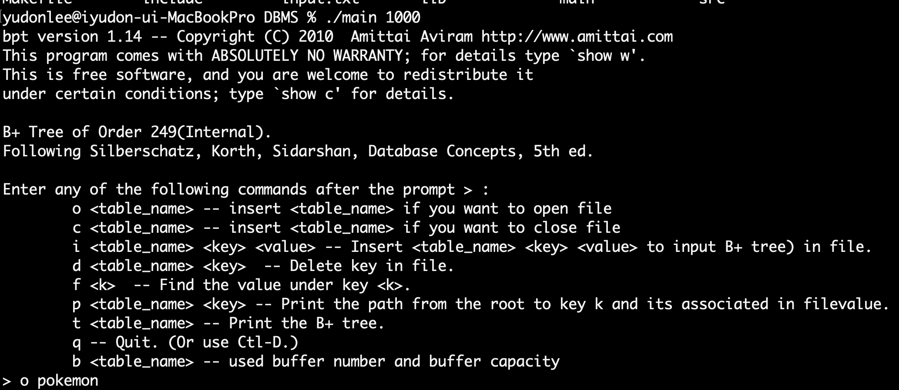
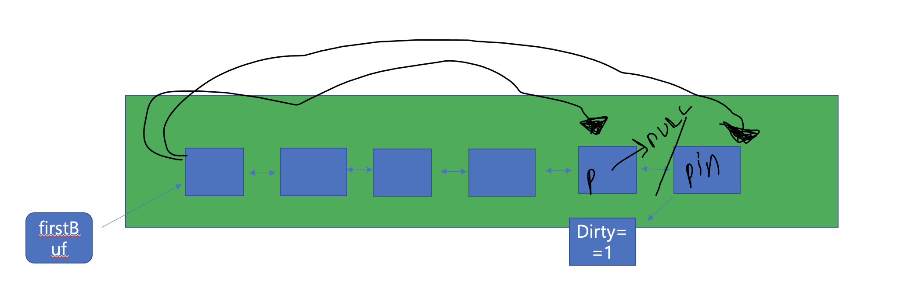
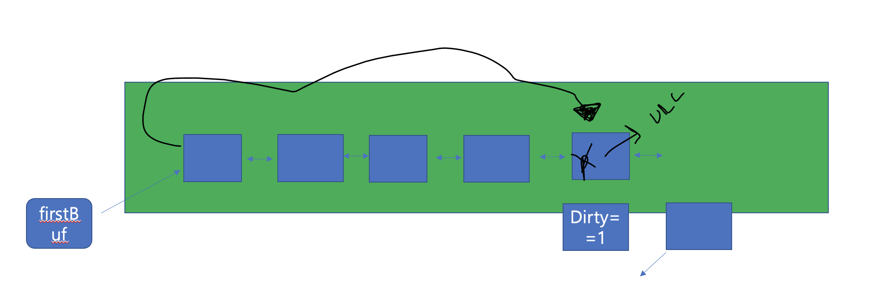
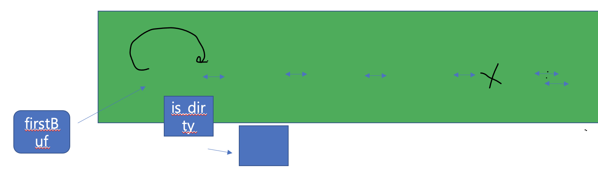

# Buffer Magener

disk-based b+ tree에서 buffer management를 지원하도록 구현한다.

# Policy

- 사용자가 읽고자 하는 페이지가 버퍼에 존재하지 않는다면(캐시 미스), disk로부터 페이지를 읽어 버퍼에 저장한 뒤, 버퍼에 저장된 페이지를 읽는다
- page 수정은 buffer에서만 발생하며, 버퍼에 존재하는 페이지 프레임이 업데이트 될 때 버퍼 블럭에 dirty-page를 표시한다.
- LRU policy에 따라, least recently used buffer가 victim page로 선정되어, LRU page eviction시 disk write가 발생한다.

# 컴파일 실행환경

Make
gcc compiler
macOs monterey 15.0.0(Ubuntu 20.04)

# 목차

1. 구현결과
2. 구현함수

# 1. 구현 결과물

make로 만들어진 main함수를 가지고 실행합니다. 이때 argv[1]에는 할당할 블락의 개수를 입력해야 합니다.

pokemon DB에 (1, 1) = key, value부터 (250, 250까지 넣은 B+ tree의 결과물이 나타납니다.

# 2. 구현함수

## 1) file_read_page

disk로 부터 page를 읽어오기 위한 함수이다.

- find_buf()를 통해서 전체 buffer에서 page를 찾고 존재하지 않는다면, file read를 진행한다.
- file read후, 페이지를 버퍼에서 읽어들이기 위해 find_Buf()를 한번 더 실행한다.
- 이때 find buf에서 page가 존재한다면, LRU policy에 의해 버퍼를 가장 앞으로 위치시킨다.

## 2) file_read_buf

버퍼에 존재하지 않는 경우 file에서 page를 버퍼로 불러오는 함수이다.

### case 1. 사용된 버퍼수 < Buffer Order

- page에서 읽어온 뒤, 해당 버퍼는 LRU policy에 의해 buffermanager의 firstBuffer가 된다.

### case 2. 사용된 버퍼수 == Buffer Order

- read하기 전 pin값이 0인 것을 찾고, 해당 버퍼를 변경시켜야 하기 때문에 pin값을 1로 바꾼다.
- 현재의 버퍼를 기준으로 이전 버퍼와 다음 버퍼를 연결시켜주고, 해당 버퍼가 dirty page라면 file write한다.

이로서 사용된 버퍼수가 1이 감소되고, 나머지 과정은 case1과 동일하다.

## file_write_page

메모리에서 disk로 page를 file write하는 함수이다.

- find_buf를 통해서, 버퍼에 존재할 경우, dirty page로 지정 한뒤, 해당 버퍼의 이전 버퍼와 다음 버퍼를 연결하고 해당 버퍼는 first Buffer로 바뀐다.
- find_buf()가 실패할 경우 memory_write_to_buffer를 호출하여 메모리에서 버퍼로 page를 write한다.

## 3) Shut_down_db

버퍼의 플러쉬 대상 버퍼에 pin을 넣은 채 firstBuffer->prevB(linked list구조에 의해 마지막 버퍼를 의미한다.)를 buffer flush한다.

이떄 첫번째 버퍼 포인터가 첫번째 버퍼를 가르킬 때 까지 해당 flush를 반복한다. 그리고 첫번째 버퍼를 flush하고 fistBuf pointer가 null이 되어 마무리 된다.

**_Flush 과정_**

